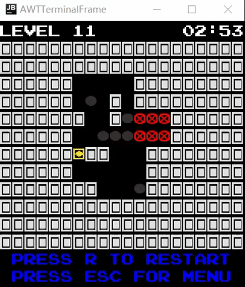
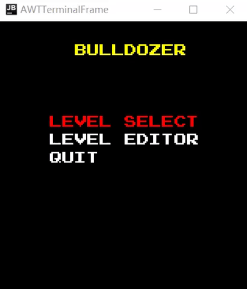

## Game Description

The Bulldozer is a game in which the player controls a tank named dozer and to win, he needs to push the boulders towards the targets. It consists of 15 levels, which will increase in difficulty each step the player takes to the end, with more obstacles and more targets to put the boulders.
This project was developed by Afonso Castro Vaz Osório (up202108700@edu.fe.up.pt), Haochang Fu (up202108730@edu.fe.up.pt) and Inês Martin Soares (up202108852@edu.fe.pt) for LDTS 2022-23.
For a more detailed version of this description click [here](./docs/README.md).

## Game preview

### Instructions

#### Arrow keys - movement and menu control
#### Enter - select in menu / place element in editor
#### Tab - cycle element in editor
#### Backspace - delete element in editor
#### M - mute background music

### Practise your problem solving abilities with this puzzle game!

This game allows you to develope your underdeveloped brain to solve trivial to difficult puzzles. Trust me, you'll like the brain you are going to accquire after playing.

### Lack the head to solve the problem? Call for help and *RESET the level*!

As the player progress throught the game, it's only natural that the player get stuck in certain situations, hence why there's a reset button. The game is very family friendly so call someone else to help you!

### You won't need spotify with our *BGM*!
Yes, this game has sound effects and music, to keep you engaged throughout your gaming session.

### Clock is ticking!

  

This game has a timer that allows the player track their level time. Beat your buddies in this big brain game and have the fastest level clearing time<!doctype html>

### Edit your own level!

  

You can even edit your own level, sky is the limit for your imagination.

## Screenshots
- ### Menus

  <b><i>Fig 1. Main Menu e Level Select</i></b>

    

- ### Some levels (not to spoil everything)

  
  
  

  <b><i>Fig 2. Level 5  &nbsp &nbsp &nbsp &nbsp &nbsp &nbsp &nbsp &nbsp &nbsp &nbsp &nbsp &nbsp &nbsp &nbsp &nbsp &nbsp &nbsp &nbsp &nbsp &nbsp &nbsp &nbsp &nbsp &nbsp &nbsp &nbsp &nbsp</i></b>
  <b><i>Fig 3. Level 10 &nbsp &nbsp &nbsp &nbsp &nbsp &nbsp &nbsp &nbsp &nbsp &nbsp &nbsp &nbsp &nbsp &nbsp &nbsp &nbsp &nbsp &nbsp &nbsp &nbsp &nbsp &nbsp &nbsp &nbsp &nbsp &nbsp &nbsp</i></b> 
  <b><i>Fig 4. Level 15 </i></b>

 

### End 

  

  <b><i>Fig 5. End Game </i></b>

