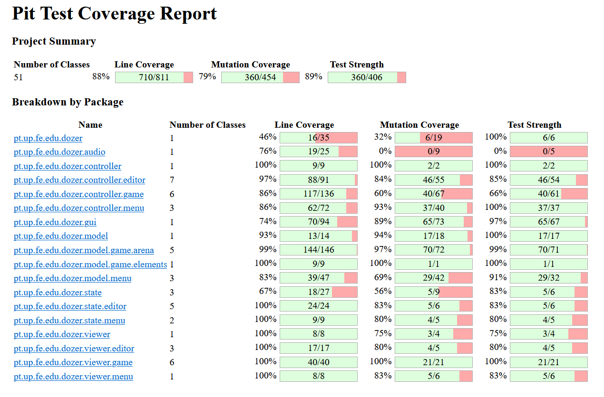

## Game Description

The Bulldozer is a game in which the player controls a tank named dozer and to win, he needs to push the boulders towards the targets. It consists of 15 levels, which increase in difficulty, with more obstacles and more targets on top of which to put the boulders.
This project was developed by Afonso Castro Vaz Osório (up202108700@edu.fe.up.pt), Haochang Fu (up202108730@edu.fe.up.pt) and Inês Martin Soares (up202108852@edu.fe.pt) for LDTS 2022-23.

## Implemented Features

- **Menus** - The Main Menu has three options: Level Select, Level Editor and Quit. The Level Select Menu has the Select option, as well as the Start and Quit. Level Editor goes directly to the editor itself.
- **Buttons** - Functional and interactive buttons.
- **Keyboard control** - The keyboard inputs are received through the respective events and interpreted according to the current game state.
- **Player control** - The player may move with the keyboard control.
- **Collisions detection** - Collisions between different objects are verified. (Ex: Player, Walls, Boulders).

## Planned Features

- **Saving Levels** - Allow players to save levels from the editor and then select them from the Level Select
- **Editor Level Cleaning** - After a level is finished in the editor, check which walls are important for collision and which are not

## Design

### General Structure
#### Problem in Context:
The structure of our project was one of our first concerns. As we had the idea of implementing the GUI as a graphical interface, some patterns were listed according to our needs. With so many components that needs to interact with each other, we need something that makes the interaction to avoid Dependency hell ( a lot of dependencies where a lot of modules depends on a lot of other modules).We also need the states to control the current situation of the game and future events of the game.
#### The Pattern:
We applied the **_State Pattern_** and **_MVC Architecture Pattern_**. By using these patterns we can avoid what we stated before by integrating states to the game. We can also avoid a chunk of if statements by using polymorphism to switch to the right state.
#### Implementation:
In terms of implementation , we have 6 main packages, model (store data), controller (logic), audio (music), viewer (visual effects), gui (graphical interface) and state. They all are associated in this way:

  

  <b><i>Fig 1. State pattern screenshot </i></b>

The different states have implemented the **_MVC Architecture Pattern_**.

#### Consequences:
All the states that symbolize the menus are made more explicit in the code, and thus do not depend on flags. Thus, it also facilitates the addition of new features in the course of development.

### Observers
#### Problem in Context:
During gameplay, there are things that don't need to be checked every frame.
For example, checking every boulder/target combination after every move to determine how many boulders are in targets is inefficient. Since there is no need to check for boulder/target collision on moves where a given boulder does not move, we must find a way to check this only when said boulder moves.
#### The Pattern:
By implementing the **_Observer Pattern_** with target controllers as observers and boulder controllers as subjects, we can avoid unnecessary checks. Only when a boulder moves, its controller will notify the target controllers, which will then determine how many boulders are currently in targets. This result is then used to update an integer variable. When this is equal to the number of targets, the level is completed.
#### Implementation:
The BoulderController notifies the TargetController (which implements the BoulderObserver interface) that it has to do this check.

  

  <b><i>Fig 2. Observers screenshot </i></b>

In target controller, we have a private field that tells the number of boulders on the target and the boulder controller has the notify observer that at each movement or step of the bolder makes the target (observer) check if the bolder is in the target position to all targets. If so, it increments the number of bouldersInTargets.

#### Consequences:

This strategy made de code cleaner and easier to read, also respects the single responsibility principle (the observers only activate on their respective game state, when receiving an input warning).

#### You can find the related classes in the following links:
- [Click here for the TargetController](https://github.com/FEUP-LDTS-2022/project-l07gr08/tree/main/src/main/java/pt/up/fe/edu/dozer/controller/game/TargetController.java)

- [Click here for the BoulderController](https://github.com/FEUP-LDTS-2022/project-l07gr08/tree/main/src/main/java/pt/up/fe/edu/dozer/controller/game/BoulderController.java)

- [Click here for the BoulderObserver](https://github.com/FEUP-LDTS-2022/project-l07gr08/tree/main/src/main/java/pt/up/fe/edu/dozer/controller/game/BoulderObserver.java)

### Unnecessary collision checks
#### Problem in Context:
In this game, the areas that the player can't reach are filled with walls. However, it is impossible to touch most of these walls.
Checking collision with every wall is inefficient, since only a handful of them will ever be actually important for a collision check.
#### The Solution:
We can differentiate two separate types of wall.
#### Implementation:
By creating an "ImportantWall" class that is a subclass of Wall and is functionally identical, we can differentiate between walls that are just decoration (notably, walls behind walls) and walls that matter for collision. Thus, the level saves two lists of walls.

  <b><i>Fig 3. Model structure </i></b>

#### Consequences:
Since ImportantWall extends Wall, every method that works on Walls will work on ImportantWalls, and due to polymorphism, a Wall container can hold ImportantWalls. If we ever need a container that has both Walls and ImportantWalls, we can differentiate between them with down-casting.

#### Related classes in:
- [Click here to view the model.game package](https://github.com/FEUP-LDTS-2022/project-l07gr08/tree/main/src/main/java/pt/up/fe/edu/dozer/model/game/elements)

### Various objects to instantiate
#### Problem in Context:
As we have many objects that we need to instantiate, it becomes difficult to add new functionalities without an appropriate design pattern, as it might contribute to the rigidity of the project, in other words, having to make changes to all the components and functionalities everytime we add new type of objects.
#### The Pattern:
**_Factory Pattern_** was the chosen one. By using this design pattern,we ensure that we can instantiate different objects regardless their types by using their corresponding superclass, so we can add new features like new types of objects(ex: enemies or obstacles) without the need to worry about rigidity so much.
#### Implementation:
Products were created (abstract and concrete) that execute the decision made in the factory. At runtime we don't know who will be called, instead of having if's and else's in the client, we have all the decision logic in the factory.

  <b><i>Fig 4. Factory pattern : Viewer model</i></b>

  <b><i>Fig 5. Factory pattern : Controller model </i></b>

#### Consequences:
The pattern gives us a way to turn off the implementation of a Product. Adding or changing Products will not affect the Creator as they are not tightly linked. It encapsulates the code that creates objects and avoids duplication, plus we have a single place to maintain it.

#### Related classes in:
- [Click here for the viewer classes](https://github.com/FEUP-LDTS-2022/project-l07gr08/tree/main/src/main/java/pt/up/fe/edu/dozer/viewer)

- [Click here for the controller classes](https://github.com/FEUP-LDTS-2022/project-l07gr08/tree/main/src/main/java/pt/up/fe/edu/dozer/controller)

### Editor View
#### Problem in Context:
When drawing the screen during level editing, we're drawing everything as if it were a regular level, but with the added placer icon.
Therefore, we needed a viewer that could do everything that the GameViewer could do with a small addition.
#### The Pattern:
With the **_Decorator Pattern_**, we can take an existing class and extend its funcionality without over complicating the inheritance tree by wrapping an object of the initial class around a decorator that adds functionality.
#### Implementation:
The EditorViewer class has a field of type GameViewer. When calling draw() on an EditorViewer, it calls the draw() method of its own GameViewer and then draws the placer symbol on top.

  <b><i>Fig 6. Decorator Pattern : EditorViewer </i></b>

#### Consequences:
The EditorViewer holds all the functionality of the GameViewer without subclassing it, and if at some point we change how the GameViewer draws the game, those changes will be reflected in the EditorViewer.

#### The related classes in :
- [Click here for the Editor Viewer](https://github.com/FEUP-LDTS-2022/project-l07gr08/tree/main/src/main/java/pt/up/fe/edu/dozer/viewer/game/EditorViewer.java)

### GUI
#### Problem in Context:
The Lanterna library has a vast list of unnecessary functions for our project, which many violate the Interface Segregation Principle.
Another point to bear in mind is, when using the raw library, the game, which is a high-level module, started to depend on a low-level module, which violates basic OOP principles.
#### The Pattern:
**_Facade Pattern_** was the chosen method. The intent of this pattern is to encapsulate complicated logic in a high-level interface that makes accessing a subsystem very simple and easy to use.
#### Implementation:

  <b><i>Fig 7. GUI implementation</i></b>

#### Consequences:
The Facade design pattern provides a unified interface to a set of interfaces in a subsystem. The Facade Pattern allows us to disconnect the client implementation from any subsystem. Thus, if we wanted to add new functionalities in the subsystem, it would only be necessary to change the Facade instead of changing several points of the system.
#### Find the related classes in:
- [Click here for GUI and LanternaGUI](https://github.com/FEUP-LDTS-2022/project-l07gr08/tree/main/src/main/java/pt/up/fe/edu/dozer/gui)

### All the related files:
- [Heres a link to the directory of all existing classes](https://github.com/FEUP-LDTS-2022/project-l07gr08/tree/main/src/main/java/pt/up/fe/edu/dozer)

- [Heres a link to the whole UML diagram](https://viewer.diagrams.net/?tags=%7B%7D&highlight=0000ff&edit=_blank&layers=1&nav=1&title=Diagrama_sem_nome21111(1)(6)(2)(5).drawio#R7V1pU9tIt%2F41VPHeKlNq7fqIISFMSIYJhiTzhRK2AGVky%2FECOL%2F%2Bal%2B6j2RJ7m45cU9NzcQLQtF5%2BizP2Y6Us%2BnbxcKeP3%2FyJ453JEuTtyPl%2FEiWZc0wgv%2BF72zidxRZRvE7Twt3Er9XeOPG%2FeUkb0rJu2t34izj95K3Vr7vrdz5svTTY382c8ar0nv2YuG%2Fln%2F20ffKv3VuPznEGzdj2yPf%2FepOVs%2Fxu6Zs5O9%2FcNyn5%2FQ3I92KP5na6ZeTX718tif%2Ba%2BEt5d2Rcrbw%2FVX8p%2BnbmeOFTy99Ll8vN1%2B9q%2F%2F0i7%2F%2BWf60b4cfR5%2FvBvHF3rf5keyvsHBmq86X9q9UNBpdzC7OjPHF3VofusrPAUoew4vtrZMHNvTX3sRZJH%2Fn1SZ9kMtXd%2BrZs%2BDV8NGfrW6ST1DwevzsepMre%2BOvw9tbruzxf%2Bmr4bO%2FcH8F37e95MvBx4tVghNZD6%2Fmet6Z7%2FmL4I2ZH%2F2C%2FIduwosFH0jBuwtnGfzYdfoYEPbWJ%2Fut9MUre7lK3hj7nmfPl%2B5DdstTe%2FHkzob%2BauVPky81fMqJNF6cxcp5K2AseeoXjj91VotN8JXkU0VLAJQcIdNMXr%2FmeERG8t5zAYt68p6dHIGn7NK5mIM%2FJJJuIfX0UBSkfu0v3ZXrz9qI3fbcp1nw53HwwALAKMPwmbjB0TtNPlj5853R8UdBQVXKUECZjItY0AEsyBIzMMgEGAbRHQdKTjkNfzp4Bjgqgr%2FvKpLWwv%2FPwQ4vcJ5TpHjO46oSJ8u5PXZnT1fRd87V%2FJ0vyWMI3%2FKDn330IjX87E4mziyUsb%2ByV3Ys0FB6cz%2B45egxacPg3%2BDBnUkn2pEW3PhZ8Brlr4N%2Fw68vVmf%2BLPi72G4kbidAy6sTIgYAQv2B2o6ERPIBtpvJXWUldhMU%2B0aInaXYtabHnZnYFULshJQ9N5JeLOXUaUKdRDwNhOU5uUxHocjPB4iQu0LKXQFk7NkPjpfZKuV8EX8Xk%2F028Zbx686enYXLVOyG2kzsSN9d7Nf3b%2FoPY%2FC6%2FKhd%2Fxqjsw%2Frt4sBgsQ%2BDN1zZ%2FXt%2BH%2Fi0LOUvtXw0CsUTPyVPDt9vLn8abwfrBfP3t8%2F0A0aKFa19L8L6bOVPpIbil9lJf70woT4nZ9r21sep%2Fo0B8IwiNAdmwwGBBh2BUNTf58GGMB7VkgwjIIAyCFPvgj420Z5qZAlBZCyCkhZk1lJmfTuv9rhjwkZ04nkM8KmVuYmI5mDPh6g5c%2Fko9PhjbN4ccdO%2BGIYPA%2FdCyX4sAj%2B9BTruuSd9I0rO6RzZnb6QXAzD%2FmXMQA9r6YpBpg9akkvP%2BsBAuMoBD1sCmoUfNgqyZq885xp8Fe%2Fc53XkD6NH17yZuXzqziAijiAW1GBcWmBl9vQtrIDhVbhaE0W9uuxE0NhGfghF7eXubP14gcXPVRPqwh6mcRK%2FdnbS7YNvGWNZNwv7KmT6gphlVkpBQ0wywpIvUgUZD82h5%2FPg7udvnwfydq7zejX1B%2FA%2FHqoEhLjcByog%2BDIJPohUAqj4BVoTUapHRHaoyJOqz99uygMEDUyBcIOBI2%2BDTTLMmqC33965S5XBFIElHqGUurv9wYlMsWfOyUYmEbu1BF4YIsHw%2BSHB%2FCWddIXOfd%2FOQvhjNB1Rgys7mMAiR5pPCkCnfRFCgFKhAIRnbRXAjoN%2FwJEAjslQIaqIUEodABdHWClKYJaHcCKGoYlT7qWBR0Qs8RCBbRWAVpjaNSoAAgI7FRAZe2n0AK0aQkLdwWgGlCQq2SmBsgMUUENZEXAQhO01gRGY3i0ZSeZaQKyPiTOCQtFQFkRyEaTmICrP5DeEawILnxb%2BANdtIDVGBv74g8YJC9ASNmZTU7Dppzg1YPnh8dxGLyVHGGkxy%2Ffu%2BEvjh58IT288NeziTNJPgie3mLzLXxxoppm%2Bsb38Lsnsmakb5y%2FFb9%2Fvim%2BunYWbvA3DzsPOhzaVVz0Uv040mSeMyk1GJHyg9T2wvHslftS%2FEFYYsnlrv2o9i7TE0gyy3pCwev%2Fl%2F56MXaSn8slT15Kw7PnGt5XEj8K4lKBoO1N4WvJIcJhlj2JHZAH0RLVyEstQxW22gGhjXxBsoaOyE1ZoiVxCTcyxKUqJE5Nng2KzP90eSJFRSeGYZimLpuqIaeP4E8QryrESxzXLKJrK8%2FtB5%2B1OKGqFV7ijJ9SnSPVwQwzlLuFHz6EV%2Bo2lbuFcwLc5Q4Rgd3l7ry5q9ih05JX3wuf5I5c%2BGLDCCvGXmEFIdz16qwkEF5vyh8tEF%2F0e6PF2i%2B0KCqOFqMrWohL8UaLSXqAn5zZOgiqVwvf8wSntA29zTmlARngpZXQ2wYMMOOULLjcsb34RR30VvETbgTP5hNY%2BiSdHEo%2FeNgrR5x7amNFiK4IiRR8NrymKPjUlNPvMk7voOQkBKYgbDS9uwxzCcf%2FiznkqPr5EswuCCYZPk27MMkgDpgxyUiCqOQEB7kRSLFQNAtxcepp8Ezsyp4ZAZAdAQKUpPIGCOwfChNBtwKxkYmQIBPBqhEma7MATYSbmYhysXqIDaEOmqmD%2FGztZDAgVKQhPwNUQBxkC4MhAMIUICpZpAADhJ3BgLoYqukneslpQz0qJaclk3Ny%2BtV9W%2F0rb%2Fy773ej%2B9O%2F5Pfnd4sgyDtqzV3RSk5n9EJmVfDBNU15KuJKmRfCiabK0uyHnMpSiZRGV3nqW5HBXJ7QpKMdWOpcEWhFNSBtUQHdT7uqjD5sBv%2Beq%2FMfD9dXT59v7rVBNmdmTwCzXcyNiWqZ8FAbIqa6OKUqa47zZOlvyiEYX5MuIFG7oirOyVVrv1IgqonJyOqIq%2B0qjbUiQrIwLCbeAIe61ryQV%2BIuz3ZFEtT8T0kyMP9Ttfj6nzL6eOdPXjab1ytNff187%2F%2FzuO5kkWj5nwO8YEbtXkqFTgzNyv5JKyLyiTLKiWXwBZpMV3F0ybNXeT2Iqtez3TgBYFzO%2FY2mfjm%2Fml%2Bf%2B18u9JHlbHIjuyd6b4A7NZ1r%2FQa4p5VFTLzgCMy5em%2BPV370OK%2FtVTgpjMAny6Fg2aEHJilagEyZTdUEVidcTkN6xp6txKw9KrJOP8XcQnCBAqsMNyh7YIFC0jwvZE5H5pq6bzIHhrslacrmMhcbM9riQMbOvkHCQAZLmyRmOIBHMyVz8k%2FFDO0iCOpP0k4JKkjqNPIP8C2TvGIo9HRzlJA6C6lDZQqspA4GFiaZqw6l7jkvjvd5PT0qzs0PR%2B1K0TvB16QsyBFwoAYHoFOasxJokIMUu1Noiz2rGNkmdwpVjbAWgCj8sEF%2B6axiA3AseuPZHv2MTu%2FPFEC0XAKC6JgLDLDGgMJR%2F8MYqFqiFGDgKvEJBAxYw0BvaA7YuQFVk5MCGCRzkwQKWKMAmPXPFwUaVMeaoCAQn%2BcuAy8r5IGXx%2BPSywwZxXHNMWGcDWQOblp5Oz0StYwMqATUN5egVQ1kDl2JCDCNcSJ0DEukpLmv%2FpBSY2niAW3L4%2BT%2FIFrSxV4wXoSSYQcdvW%2BuAhzmFULHXaY%2Bilj7xw8PVt9OKzhiK8ZDaFNwMAgkMEKCAmwD5YyEqijWXcb2QigGjnBQ%2B%2FZGwWFeyW7g2BvNYVDliQpcUMdFqq%2F7w0XVLrun3PeEkVH2OgU2qGPD6t25rFoh8JQxYFXgSD8W8GAFD1Xu29e0alQHRo0J29IDQIDluZwBUqM%2FojrKAi7gukoBgl1BYPTteEKtcenq6WgbHSZyUVYZPQZKk0HSjoR8jKkKaAWwoJ5dRT3QNBfWWy3HCyc4aKlGuIlfJgVXQjHUKYb8kO1UawnhgKFiaDA%2BXNRZURc8VG4JCZ5CnVXFLcPlluEekrNne2GPVwXWOjgr2Zvhn4MHtV6IlBhj5QA0XTFTDv7Xkff9w9sv5Xn67fr9mWd%2Bn7yDXMdB7DjerBbh4XWnzvEq%2BE8AA8%2BfPeWIiD8%2FWEwUfSaJHUDM%2Fq1HVfQZuA32yom9h%2BORs5i6M9sTGoOxxgBLN1khApyVBM0kDfHg%2Bfbk5uc6%2BDu%2FD85GIeQ8%2FTpK4RF%2BEjyzR%2FdpvbAjsyPcTkY4gco7QZxQ8D9AnJDh6CDTGikejmNXUz5LOn%2BCB5jXUdThJplcl34uAEQfQHpD00MjfgUBREavGav1ORDv6TgEQjrD8PRsdPn3Z4ED%2BvGrxNEFgRVJVe1NGMmUqi3CR0Ak24UjwgYXSt%2BOCDgTKsVFzHsLYPQADK2p58EMGFUlOSEwRoGAm%2BBClHMyhIgJ5FT58h5gmU6Ij2vPHjfTHAIhnEgQBVjAwxkuIAkSqZOQIBNg2SOwKL37q1UlgGPPsUUvG3Proui9e6aVnKnnLx2BAOYIMHt3QatKchbO48JZivZ25hhQEUcfE75pYKzdO8%2BZBn%2FVeB3LcO2GxZuE8MWUu66TDcn551AZDrRqg5iATBEGNURmSF%2BVN7lF77hik1sDpSC3DzybbuZhpxOquIm0VjNDQ2QfCm8JOFCHA1SiwxkONe1CceNHtsQrwkPyngAEG0BAM9E4A6Km2D9p9igj4ihsJyy8L1BBHRXgyDS%2BsFDIIRfllX6jygYPUehN0cM08E0oKjA5B1wOnhVkMAAHOdciLLWY%2BhPHy5TESCiGLYohO2O7uJOg7BnqhQYLukRtN3XBA44jKHhmR16FaiKUMCGRMAzL46jp56xcu3ugGqBo92R2qACquTmrg5TtgLzHT6E5KHiNn2LzsM19OBSMsIMFUMPNGRZ6FRsdKoxQUQg2unuKsj0goBpu3oqi3aJWavvXLEs5Ki7%2BPEFG9gaf%2FWv19nTryqtEwMGNZzmJVPtrpFAprWiz8EWOakoTtF%2FRhq%2F%2B0xqu%2FssvlX7Rf3xcOruuyaoQB929s%2B3QsidrzwihK7rUTejElTSzmcypyVOD%2FBIhz47yRJKy7VLMBQrFH90FmluIsnXQttiGPwMIKn4cuwNBNawTq%2FCPyRkWsjjn27Vtc%2FGqHRV3%2B3Xe%2BBLY9DfRWucNV8mQXmjgmgdRhuc1L4tQBJHdpVSC8AOhIlsEHBMqRDbc8AUPLBA8dhVDUX%2BodqqKgCTPrFpObuAeChabttih6gdI7MyOe02qOyUrBVPJUQ9A00hY6QEZfbzzJy%2BbzeuVpr5%2Bvvf%2FeVxDe4AzRNyEnmHwx%2BJggfXE9T%2FZM%2FtJlD3QRwM0eoSvVahCw3LlzI8%2FBY%2Fiwp46waOKO8EFh90k10UJHOAYEq7oUEifIXDLV44IG1iGDSoeJ0LTTxFUZo%2FSEdz0kQBPGhFhQysDkZ2nnapfuDbZpBMIRNjQPWxoL3ao9oXRXMPr%2Bzf9hzF4XX7Urn%2BN0dmH9dsF3IurHCXjsFP2KIodimSSiB4YqwOo%2BgXCBY1GGxgYUC19AoxyV0XT0lmBiR0xARXHcsUEkit3vmFBRKFcLvUZygMv70RUUVkZQwkuCNjmxNmlqGnPEgV0%2FSgRBCx14owKyLJgYqZWLdUudCuWNsFWsWVlU3rhrINWtsinT6muaYBHk8Qwwaap0oGsnOiqlP2jyAZ2ZUM9Mc38C9i9bi16yp6OVrquZpWvQ6UmCsQgUHHxyZmtK5q%2BRAt517wokXPXgcQoqH7SwIi6%2BgGrKtLyXaDeXzChbQyS1hwj%2B0J8gCuvYz%2FkIfVD3tvjlR%2Fd9bW9CrfAZN9Y5K5K%2FE5wDw%2BV7kvZOL0%2BuyvnJhBt%2BOnrwp6XLRmrU2kg7FBqwFwHBPHPNKbTGuY%2F%2F32aP976999vv1nvPr4zrpbgGGxMBAkfjQtg%2Fx%2B31qQ4JHPWaT9u6fa%2FT77hqLruv01XP4Zfzv7%2BOSA9sND6NbV7guyn0exqNo7OKHB%2FIApI6i9k%2BsOaUNeBd7anayqS4ybGzZeBUnvW9tIggndMtgtEs%2BbXi%2FBv%2Bm4W32wMjtidj74kCSTQRkLT5AAzJECdbpiMRUqIstCBqSmsMkLgDUPecBgezYLDHB1%2BMW2P7amHOly5nnoEeeMhBOYL58X118scBgIADAAAdrTyRUBN6WAsfAd3A%2F4nFpmxhASwgIgzJKpoM3d543jOeOVMKkEx9H3PsWcCFbRRoZOjtPiiojIhHK4VWk8fnMW7OJwsOA1pVkAggSISmtYGsEMC1GSeIOGsEDoei6WXrPkD1LcDCdSQ5p0HibEItIPQCWxxoPbtRqZ0QREHIWc4dEPS%2BDEk4oOXwxAZUb6tGf0sZi12op%2FxYd4WVGuuA%2FBQNAr4mN3dj3%2BY%2Bt9naGSM36%2BUx58%2FHoCdhHbUfJKTz85sPRWKoV4xZKdsJ4YZlDwzxdCgBEgQi7TFDmxyAcXObM6iRNYD4utHBbN4tLXrjBIcjIb6n93cNInMQGZbSAUUOELBamgQGEKBTDVFC%2BGiSkIBBp5gyFas9IgGMgkVoiEZzS%2FgwBUOKkA9c4YDySeIzV99QMEA%2BGbOUCAjh3xBtQADRzBkBT89goEkEMROSP5AaEonMAQCWbEAroeNCxbJ%2FwqAMAUIVMfGCiDgxmmTVBTZ9nqhK3hCAapu4wsFkoPKNo8LKHCEggLsAeMMBdiXvPbssXAmOYNB4ehMwjlrqFcdk3lPXcmNm43DjRBqAuoszVfjnO3YcGzq5d%2BVjbNq22%2BMX0jRsAvx3aIA4wPomQpOS5u%2BKdEvvLVVDuuRguahwQunU2NCXy9UzVXN6x6vnBfHi1%2BU9oiKoscGtkKh0R%2FFbH8ofMtVC6AwSLybuCt%2FISDBHhI8V0%2FDt1zVNZND4p%2B1K9QDByzw3DoN3zJZE12wEMJZoFbRZjVwFuCdC6z66sEFspEamI0X0WSRpBT6%2FPIp0gYJ%2FSgCzeYKYa8XMsCVu1X9dBMHRoXAA0s8NN3UwA4PUHl8OFpzWW6VGPnHeSVs3CwhsMEWG5DzwBcbZKaCaJ2IvAkhe9qyRwAhzVn47TjIP3Lhm471KXQmFS1py4Xore%2BDhdluzOXWpY5v7ire%2BquqVvI6XusoITV5ne91DF9sCi922%2FgbP%2FK6w6buF4awAWdq10GYW8HIGkMQ%2BXhgCmHrOe6sEBpmGToIc3mpyN7t22Z1er95%2F%2BHb%2FL%2Fly%2F2A9PpOA0HYw7UbFrUSchXdbxS5gnwWbip8oGEaNvapR7aLtQfx0MDYix6oDAe1R4o6F0ChBQq8YcgnCL378cKxV06kD46j%2FyaTM6I%2FE7A4XFefDgoUjo7%2Bcu5vNPXL%2BdX8%2Btz%2FcqGPLGcz0Gu2rny9DG4qXdZ4yH3xWypP6ECB55ZGGApQMjGBwofoBgQWOGGB545GGAtQFlHJzEPa5BChIXoh8MASD1zXMsKAgMYr5YAIG2WXKSCKc3rDDw5%2BhQofjACD2ThjBMo55hgJpOm5y8BHF2DpHyzAvDa%2BYEnr6yrAkjTYgjBJPhNI4YKUxvQEM6RUJSljpMSN%2BSBQ4o8ETnjgBJr1xg4n0C2TkeyVbwd6QnCb3LhNDctSaEAzBQwKi0LVNIgKMqgNVwh4YeI6L2k45IC2oULQGoOhh2In2B0lKc5I9O6s2U4RAQi6gOBZ7QR22Yk0x85pjtZCb1rGRCHNAcpcpDm6eooSK0jwJDdBTIiUx54ggSutCUIBXDAiWIj9QwpPchNGimAhfgec8OQ1QZwIDvy3wQpPZhMe%2B1GLFQGR3iHCldQEISLy8HuFB2CRBV88iBqdvcGCzjPfDuZoeA4KSrs%2B0IkkGUelrg8JHbXt%2Boj2s8VNJFJyF8Eb8fVkRU7fyC8YvdoUX9FrJKllj%2BNS%2FLovJuJt06RAa%2B7RQElbENIiwhQTbVsSDPw6fDsSZMjOVUP5j2wvyfawZ2vZO7aXbL0Qa2FCfu2hCVOlJEy8g4y3MNMMbkNh%2BvPIuOdGBZUtjtyPpGkpXFWhJFbiQiZnsUJ01l6ItWhwwRnLco%2Fy33oam8ofr5TIRsjwkn8733En%2BRecvXCjR8nZk2SFvbNXhJR%2FpaLR6GJ2cWaML%2B7W%2BtBV8hb9PiCVWRzakLIatggHMrY3ha8lgVjlDaOKG666L%2Fz76bq%2Fyu9btd8P%2FhDfMd3z0K5HnufQVXrozaezSnI6YiKbgXyEB7PUAI7jEh961Rng%2FQ5nhXHUrk%2B%2BJ7sKw0jqTwlW6RRuGGmrBI1aHchIR4m4Kh%2BVkMoX95sbx1XKlguxdsCgRKEQZjdhEhfCx6wwFiY4V%2B%2FAhEkcqK5mvu%2BTCQ7FY%2BUK5sOUtAKpXk%2Bot4PHVqbbsvbH7iO564Ak3MtEckPY7Br%2BZLfc%2FM5UDs4COL6vu0oqxPBaMYJHW6L3dlhlEqgz1HkIFy0x0LcpfMkrMYreCTSmt8wWjX3OE2QS%2BfwWqFKwTBCSGub1dgyHOIFKzKSTVVzCnQ0ocSUp3UrFy%2B%2BCalsYUSfF%2BgMJo6QtdQ8Y6fTv3odTpmAOOFJk40TXDVW1NEk3EeoGMNyvRwqu1lgDjCwyQATCkhqpAnLalktV9gtnHWGvz%2B7KuZnbkVv%2BurDnO%2Bqi5h26Cq6oMy%2B5gCNo2xmNRQWwUEhS69CEomPjQE1gfQRfmZDc1P8dmEzwIE8CdkxzlUl6QwcsE0R4KL0LhaSKDk0o2RDkfVFeaZs5FzcyH4VuyEX%2B7gSlNbI8JqFf37%2FpP4zB6%2FKjdv1rjM4%2BrN8uBkhKwqM%2BXEhD00qoMDoGJaZWTlNzpoI1nlUyGZZkVC6wtiy5fzD1WHSlYP6R3jXClcxaULIGE1licmierolVxfZtK8Dpx03Od%2FFET%2Bzlc%2FTkED12qXggwSJIlO557EW7YwdyQETyzfV72U4MNM51kODQY%2BakU5lwyhIqVXxT3nqDzJJlCA4UY8uwtRoXqT1aBh0pJyqysn%2F0MphUpJ%2FoSO8ITQUHOectHeDIXdbQRO2g2R1MMvp4509eNpvXK019%2FXzv%2F%2FO47rW0Gw9kAvRovylygNmqh%2BZpGAiXZt%2B%2BhtFLXKpJSikulTSNscXYWm%2BCeiy213BY6J2LkSsBxuuQk7HpoR1y1cBlAIz0YHXIb0c%2Fvt1f3p6fodPZ0hia0%2BGLNiAVbzz958wPzKbveWICLWOKGEeEDFDECIJENmGKOibANv1wBuFsPU3GRomRDSQgas%2FXLlNoQfHTGNIAS79C%2BA%2FJaLnLmcAAYwwAg2f5YqCB5ycGz1IWOjB4FhQ6q8GzCOzWCU%2F%2Bej6xV046p0dsT2cgfGDELLMTXyF9qL0n2Z4%2BxFW%2FmNnEDgrQjFm%2B2h%2FQA2fy0enwMnTqH8OwKXg5TOfJ%2Fv2wdBYvIk5gHCfgFJ0MhAkmgBI890jPT2zQQiachHrlYDaGQU10AEmdWWhYFR1kPkK6p%2BKg3YQtC4zoYAFYxQtigV2k2G4ExR%2FZzjCQcVq1cz%2FDAM%2FnEFeiR9DC8myXWk77SEvlBOUu0vb0v2IWE8boBCGe9H%2B9a9wL%2F4%2FT%2F127TRUZ9h94YYvuvMSq7s484Us7%2FWvd347%2Bev1Xcl6%2F3nx6%2Ffvv%2BelHNXXu%2F0RdRFyK3Rg%2FGDBkFJIEHCI1wWk5nlUFga0eR9rLTZ%2BYFEHHzkEH2ueoA15RQeqCcDHeNPDqE51QCDwefN9z7BkBi0OJPZihgGe8ATtiwOkfzPyV%2B7hJSSgRgDIGgd7UBDBbV0Py1KEueHRnk1QXpAo2x0K2%2BkrAgS4coLwFX50gQR7BsGwdbudCLzAGApi14IyEKm6ygIRz%2F3UmsMAaC8DuO95YkLdjIRSGwAJrLAD77XhjoaqcrYCFL5fxJiIBBqZgAKpdeYMB4iGHkZyd%2BfGn4GFc2FMneFin47ILKRDBhFkA9tUxQ0QdhVvAQ7SWLiEZ23GMu5GHAGD%2BLD4Rb4segEPcmRGKFcmdKq9x4i6cSAckha7ObD0VCiDDRO1hos4sMqx7Iz3FQVH6sfALYBAQoAsBqNiZM63YYLK5SCpQFjtU7swop%2FDqvq3%2BlTf%2B3fe70f3pX%2FL787sFPOBVOII9KQGePCIIh8ry5zBIjDxCQRewhwFXFhFWC3XEUYQDiEIMy6MlgQbaaODJI8JoqKOUIzSI1AJzFPBkEGEU1KWYIhQI%2BpAHEHiyh7CTUEUeZkAAcs8CCyx4A568oaqMPmwG%2F56r8x8P11dPn2%2FutQHYJo0JmdIgtmya1lFxklZ9WTT53JuWQIPAT%2F5uxXpYcOpih3pYaot5JJxdxMebNN5sgrDa14Zl%2BNUrKHaojQWxR9bpnwaCtkVhLCciW8OmQg5A02QB6igLcBiwWORoyJDILMzsSC3SIXftFtEvkQCpPW47sdoQGpgZpwaD%2BAShSVnoEI8NCZ3Z%2FAaZNAsDwWfugTqAamZZqYMKaECBixI5XZGpjtyHCCRPAUgENvhhAyK%2BuZqKJm38zJp4i4FH3fPclwY7wu%2FDt9Pt0F%2B3c5RRdc%2BqBv8mWqvuYFh1jY93GB7aJkAu7VMzjgotpCh4wzyqbyOlsFBte9tx6tCXVq%2FV1jD0EXfns4KzQ6FhF2l6KPBRiMQWyd4D7zR6O%2BARppC8Sf%2BG1QxTWCpQ7lb3QiFM3Jfgj0%2Bx3x%2B%2F9ZC%2BkQ8ukrLPFvi3gxt6AN4Drlv3q67tVSDQWd1FwV9duiYGswK%2BWMka3ykGleuhGnNLXdIyaVXeTdyVv7gJvECHeESC9aIIBsuscn4KcJBlAA5UJtXCeCD1cRzXzL0oenjnOdMsmLlZLYK3qtT1Hx%2FOkLioP2K7sF0gDJiFMHKDpVeC7qItdoDvAsXO7OxD06fCsx%2B4iHeu81pqBo%2FfEGefNggAaovz2YcWYiUoyPNhBSTUJMkOBQ1bptNRggbAbDGDBhgWA0tlYmgsgxgy9w9E2Q5PVEAVnpw1BpkmiUp3RCDBa5RtJu9spztgRVQAEwar3Bm46ghUFUJPNFUNNLLmIArYGQwojoB8CcKRiAmbWINEubRK1kagZEeUQGEHK5SAt6yQbkUyREBYEF4WRDUbWBCFqwWBZucKC7KLbsgO2k4WBEIBOwtSVWchLMj%2BoASyIKxQAt8yyVzFJZrCgHDbuqc0MCBQJQkzA2I2ZiuEAWmqGtTGuKgxIBAKmBkQEyqbEQZkv1ACGRBWKIFvmazv%2Fmp7njAfvFLhRo%2FhB4gIsFFZWI%2Bd9AKNMemcww9hPfYfJb2HH2q7tU3pmp9CNa5%2BhC%2F64bXUKXnCYdGuopd0sEY8VXqdpZi6T1311o2l%2BIUa1rfmF0q%2F6D8%2BBoq9%2BB2Ozaek8xFaGGcR11gM1y44al2MTewaq0r4XjAL2MMCcuCpqqGuQnRwWtJT7GukSCgk1otvC4uypYWIit%2FBKiUio493%2FuRls3m90tTXz%2Ff%2BP49rqAzzdD1x%2FU%2F2zH4S3eicN8NC6gHuKaMxVRUGBJlJjVpRQ9fgZrVw7LwqNwLK5Wy%2BXiUfiFlaZZTUn7i97Elfzv2Npn45v5pfn%2FtfLvSR5WyAQcshJMaeO8%2BwcBa9EJKnK%2FmmjenMJE9GpaHk03L8RPaBKJ25HdygkD9l%2BUOTVlnJH77lBgGnqM%2BnLXYkAXPzGA2kgG8ZKs0Op6XNPXsjJmhyOfvgQFWuyp8MDWIQpJMnQvdPlGCzhgE0SZUrDKqmbXu%2BP78JwwKBAdYYgOaocsUA5AZE0zPXK0eIn7X4m46oYyb%2BKndg7PlLIX%2Fm8T80MZWr%2FMkK2XwqmSAI2RGEKkEQAo37CJrYQYUghCkBmBNwZ0GQZXsjN8BEpAs8f%2FYkYgMMFrWnaydCEAQBM1oIJokfnqafAodgIra5s5Q%2BRApylb4YUdqGE6IjdIgJhIROgRECb7hqx87SWUVVi8f5jOLotfAJmeoAaPYkXwtQFREGDpSzCr2AhYgL2GIAJAj5gqAqLgxpgeHFJ4EAxgiAuEG%2BCIB6J0MEuMth4gwWQCA8QkY4gPhBvjioWq%2Fz5KzKiqC2ukgAYUcgQEwhXyBAwUG8m9NeiD1brIkBiCnkKv%2BM3TzcMbsKPh%2FcBEg7VlN24ewN6axfOS%2BOd%2BN4znh1Vj1WTVR%2Bd94zpGMgUFRANRsACmhUfsNJHNJXi1DwxbFF1T9N2evYOjMVOP%2BKxFX0pHs2iGJ1e3Llzpzl8cMitsrD9eOjs3AmMSZya33lBs82aTVLq%2F9El1kTG67RYPdBtLDL9kHzDDApU16QmO98%2BF74ZOv%2BB9XUjkr7H5CUvcFn%2F8PyUpG927fN6vR%2B8%2F7Dt%2Fl%2Fy5f7AbD9ofZYNu%2BdyzZL4JsSWayHUPFlijrmoDRemaJq5dtWDexKW9vn0ithfwuym65Drxx8CNptQaG7XGdPlubg0x4HWtelOeSVGiKAmjjJuOTgxKngPikhhKbiJK5k4I21rMXZYG48rR1F7GRNS1MTZSKEOBoLFj%2BnvAVrQCmFasHu1uGeeRKDsCu95EpIJ6ZsbHMlwOVVCG1ZXxW8wP0PCk5J0dm4kmenjzeXP433g%2FXi2fv7B7pBA9Vs7WzousHN20BY0CQb%2BollWtk%2FWGK7ceM%2BNm4y86T31%2FMwoZxKd1NVcJe1fDtasi5N4%2BAub0WmtV%2BrAlVURr2JQ6arlTQ4%2BzwmlJTB1ludO2N%2FYa%2BCiDwUaM2qKwyAHFZYIWKrXPYAeWyxgstgyDqYsNzFHYcjmpwZuZxbsGgdpY%2BPCUaQ7FlNzoBTWxJ0ng4shpAxnYaI5adNtSM5CLrhGlVa6hFJUFEbc18zoboyR3OLAe5ua2sVWHMvsMzcZP4UCxcQX1pIbBFtTDcgHFu4RdhhXhM1%2FAGV9PEYt24ZOdFe0dbGDPCgI2dEtiXQ09GjDNoreomA%2B9VK2VFoqpYGuF5iyYMTbJfelQbF93DqcjO11HpzOE7jpHcMLg7PfzzbD1q%2BK4Y6EFgLG08cE1UJDPQdvhZ4YAJVCTIUUSGTmVud6jcsOT31X5wYCsdpt4aoHmuTec7P1k7j6CA0sCsfBBfCDktwCGUhCglZQwGadcsZCpVDBzIofLkM7kNggTUWgOYzZlgAp2NDBSllJNzOBQjYggAaSsUXBVBFRhkF5%2F7rTOCAMQ6Uhi4jMxyQ%2FmLaYuDMj%2FPBFGenY%2BE08gCExtFrhBUDhIhqyuSPJOYHCI%2F51a55S4I9IK5Ej5mH5UkGAYX9FoId5cQWqDjvZUKqHypNzhpT6R%2F1BuyoGD6RIaH%2BeO3EC0ByZyZ1sM1Y2PtW9p4SFhQgDGDVngC7f2AcMPYce5GeLEEJMAaB3tAQsANB1bre8SZAQjySJgdB3Xq9Q8FC0SGSmQEDGEzDFxgK5CCEwJiHDEFSpiX0A09MQINq%2BIICHE9RHSDu1C6wY0sbwzR8sW%2BtVrTb8%2FVyh%2BCXXT7etLpHutsuRSsjT960KdXfG1K12p8oJ%2FGpxd7tiuLaVJ8XkY2oIrsI2Fpk7wtZQ6%2BkJLgUwi6Ft2kyZmtStogBYsIHWOpXUMwtuKHcr1DHP%2B8LlrIq6N2xhFdgDvSGdZPUsEQyubHvnkZ2Z2GYJ5g%2F1swfXqiGoD3Z4PgSk1nEB88ctuOVx6VAL1mDfKBOPYmK%2BqO209hpCALsgn6xjWpn8re92KF50%2BDJZyV1cMroWYnvExWCfFQAwPtxVgHtmmPpzKaRuw2nQVkDeTKcRmHvvHaK8WuPXdOSfCwKQVrNbNqdJ9PgGWqz%2B2gaYlpf59k06frn7BHg7UtU6uhBYalkDFZwhYb%2BOlzsLkrqGbjKBs4gWVArCrStx2BlMFUoQdYoNxKvayH%2FK%2BxorR3NTt9ernSGb5kMtAOMiBwJRwzwXO4M3zIZThWMxrn%2FS5gMPibD7N1kAANC69zq9hWUtQDcEyY1e%2BRppYvVzafEu8%2Fx6zDmUNWqDLgw%2F4xUf6pHfyPzD4XRwvzzxED%2F5p%2FU%2BQXzP4qUlLD%2FPOy%2FAc2G5xsyQms7hM1gqC%2BMxrDZG5sBVYYIm8ETA73bDK2WZ%2FxqhzIUFoO9xdB7txiaIBn5agvt9yMZU3UlLEZvGOjfYrSb1E5rnNlRsYr6ZNuU43aKe3vqtOU0M%2BlEQdjQ4bol37tmTzU85Wl17hQmJ883zJ62rp9WrYqbrr43%2FCeMhOXcMgSNfbZWazfi78%2FsVydQqHWu4icl3bAEencUpjfNtCYf2Ny2C17gvQX1WwvaYWxrFUrjZQS8wEg42F1XowBglLD7Ycz%2FaySXgwi4%2FNkrOAeI6LYBBruy2sEJSsXqxw9q10%2BWl7ypplrQDuhEUo1a%2FQBtNemuM17dt9W%2F8sa%2F%2B343uj%2F9S35%2FfrfIhgAU3S%2Fp9r9PvuGouu6%2FTVc%2Fhl%2FO%2Fv6ZlTV2q1yD5hvRcr1MvFXDMoxuaiafjZ1prIada%2BSlyn%2F98kXYOUFIgae8OBMx5YUrt4TbK3DEOxQzMmv1QApZmRL2ejzYS%2BdU9Ht04w7y8%2Fb7EEgI7ObH5Cw6PqgLvilrxGzejwLWJ0QGOFLH0YnPZv8IEpGxIoDaPjgrgnYFatTcZylv2ojDZMvIepLbdHFkMfeJJKWedHxBPXW0eTjW9ea28fYFvNcjDW5YsJU63ovadSnMQFOME03OVwpiyw2RYp4YspF9jGG5%2BaJAfEczTiVQ8anH5vDzeXCApy%2FfR7L2bjP6NfUHUBXHgfGKFg6XzktukYRHa0bDOZhtaUXino0yt70zqwiCpaftV0auQNO2OL2LRm2HziJpcH3%2Fpv8wBq%2FLj9r1rzE6%2B7B%2BuxggqSmOCytoDGyv%2BYAhd6BjAX9XWBsYNdZwwkNbTOO3q9Rna7Tar3NJ1YCHJE1SECRF6HfCA%2BVEmUtHKkLD96U29DppbHyEhS8DKnJYKos9%2Fl8QeBS5qnh3asJIVCxPPdyApP6M7SUxAd8yNImiZrXu9X6t1tWhhiNWi3ThByhS4HIQdxGhTVdfVcM74rNdc5TtOvmbFB7OKjABOl75cec6r6LWlJ5qQCo%2BA0yG8gGsNi%2FDwofIn%2BFkYb8exyAInsfF7aWgAVtZXb0xNGqsLoQDZlYXmDQYJ4DaKwGRKGytGEg6BHDQwcUvNBKFMCDgPGFYYRycwbDGONAHN6tF8EKog3p1INNwwpmt%2FYFvGQrPMCmL5CBtsTddDEkhNwjfMbghNHQGkp6C5XHgCwQHZOROg89PPX%2F2JDwDtqoAWgfBVxW0y3z0OuBdVo%2BwjCKHocbFJGCt0ItEuaqMPmwG%2F56r8x8P11dPn2%2FutcFAT%2FIGfYx%2BJyNmIiXTPGImurDZbTmDn3i7BMxumE3xh04khOFP0gz2%2BCvCCn4aPaKKWItuSFpHVJl4V4OCD%2BOmxcPo%2BG9Kb7ry3oif0CQFAzYD5kYhgzYOMC9DfFv%2FF9%2BOCPAxAcXNV%2FLs9PHm8qfxfrBePHt%2F%2F0A3KN%2BQ3stJISEkd9W%2FOtJPNGxiJqPmseB3YbUeqr71rGA%2FYZR%2BgNFRIXuqD61zg6Qfs7wEh84NWCpkmHlwUlEM%2FNwDlQ58pUKGgQcnFWLzhwmMheArFTaditKJGhcJJbZ5EBZmyvURF9W6STASUvariZEgaPEMYHMnVimXNaF0KRRtuywZ4B03vjHKC7FgSLMejfk7ZKo10yojorPbh1%2BpYZqamjRFiWxgzTEfq7s08Suxk%2Bblevws3V7Z3%2B7XL8Pz%2F84%2BvRsMBmRoeeHMAqU%2F%2FuTM1qKDkFMHoYyXL6tQxQDkhyBT3t0RAZEBL4sKN4af%2B6%2BzqGrvSGQDMDzUnrGdygQg4dNIBoB3TKr4JCm8uQmVtxA%2BQ%2BHXzS3iIny4IiA8%2BLdzIXmGkjdq9v1wkXzV2PNQ9qEEhPQZSj8IPnsWf1XHcCj%2B6IEL%2BbOUf13nExf5Q2F6Kv8bx3PGq0K%2FuAACMyBofbt%2FCJpMWx3iU2psDClJvLJDUjls%2FCtmDOs8oj7yheQiYbXzqEkZr9domlmnRTaA3WA7cNuFTZG6hgEHWXyBs5z7G039cn41vz73v1zoI8vZ7Nt6HqpgwufDKXhKhDWY2o2D%2ByN5SJoCJS%2FVcARoB4FePH2%2FeXf39Xqxvnxnm57qT89vAdIhKUcVNCQfGhLPUCtQj6MCoJlGdwIICbK%2BbzD1J44Xe59iaFkZBbWnaifyERI6De8TvGNgYAAhZNGUQFnqEOsIHnVWQodCjuBvKwUW51N45FPuQRx6FuKHxpPxPfTtQoPdQk52vh69Mn28hbh7ghm%2FEme3ruWcgrx6uVivPLGXz5H4UG1AmBU7ycpRsQ7ZMo%2F4VTqBVRMJt7Z1iFK6VboP0BFDtDpPSCLr6ohLsUZduzI6OqhDklyAXTjy22qNuwKpkVMYjSaP021xguccygCOl5eK7N2%2BbVan95v3H77N%2F1u%2B3DfWnQlgwh4algtb8MXEqGtl3yCr9EnHbDHqThlo2FhxRa4v7SPoPewHuEwAg89ip4qxhoeP%2B76i34Low0fMKF3dhwE%2BVi6w54wAb1bcc%2BWt4T8wUJKhUrSqWUE0y2SkkvBUBKgr2ClFsFNdavUxegrJFhC0QHkyZvQU2EgvmIpWTIXcHAgtq%2BNYURXAyJSMqkifZmErY%2FaABWdBGQjp0G0eeXL4lqHQNkTCsoCE9A9iggZbNEAUFl800O3camdH98TxxJOICHXNR%2BJXstg1RsDSJKuhkkl5Db08MShxa9sDwtEiQTVwrAYlwmJvF6vy5KGL7EwtZIvRaq1y7aegCdcQatfQFGGjFPLZNrRDU%2FI3JW26bCNNnuNtMhJTQSlZnpCY9UM86HLn9ngd%2FNT57fSvmw%2B67Y5eP7pSZli349roEdeIFuOCsI5AixXhgt2xqW%2FhW%2FBTgP0Am0MADL85tCkFBOccOFWknWQ1peDl3eC9ZY6dZ%2FPpp%2BG%2BH73MVxdti%2B92Uk2RUxV%2FMRph8GM9nadOViLF6K34K3pBmYWjusoDiSSlfSawuMtKyhatxNdDaOtgJB5pGQmw%2FLejH9%2FuL2%2FPz9DpbGkMzenwRcvKLHrJaZPjtrppSKJQjV1uEQY%2FRAB1D%2FTa47sdfPYkNMSl37miYfuVWMuf7uaFQ5V%2F57mTfYufLs9zIOKnJ%2F%2F%2BAdBunk1Pzo90ostYJGe030DPJ7%2B%2BdXO9Ajg49a5QPzEgnpHu6uKQQ3obIbx9CGiWhzTWLY2jdnw4Tpre5fioplU8PhxZkPraq98b2Qp%2BoYblqK2hjY%2FBtOrZDVnZ6etbuBP8b02ZOYHPGUQfxtvTwmNROnD6z7WffjBYRqchzFQief4WITn9PF25hgp72OKL1S%2FqKxzQ5oxLlK2ozEKGiUZ7vfKXiR5oQfrgWqHdSW1D3AD5DKisHj8D1HgaYN%2BPwABXDCC86RoYMMoKErOne%2Fl%2BefuPdvPt8%2BPNveP%2BOP8KTHyrs75%2FZJZaxm1Q5w3XCt4FTVyJXiwCSrPdpAY6Ze6KUuqu%2BA1iiroS9a21vWafnGkZXkRLdmPOxNhyIWoBBfaLZMqrLcFDIBOH4NBSRMRWFxXo3WaVIQJl0o4jp7OzoqBCmnTMtBPG9r0SPcZn%2BP4Vsyu5pmAlOabF156R3Or%2FHdhRxiNLEyhsZHWSwfIL8iSf%2BfNN1Ic9XLveRIzlKAKCEHRTjFRHkRrmZEI7CiqWxVGogQcxQR7TcEbog710kv58SXTrN0RE9ZkjEVHdAcFsWSB4ew0SIAfe90Jf6By3hoJ3B7H2Ya%2FDeOHYq%2FjYH0f%2FFYM6MLMnsYIEz6Wh4O1BDHM4MTTwEL9eBveUDm1JnUWBBEZIMPu2CODQJiVTD0N%2FHTqKyxQQV%2B5yldLHyWfb6GMBFBpAQaihGWGHFIiyzJEyiuJLECjxRwInXHCikMPoOeOEZPWKOAmk6bnLwIH7anseCJfwAwEWLmDRyU5czmCB6tFzsAiM9I8RYFoDZ4xAlHSOkXP%2Fl7NIMRK9EIBgCQgZ9e6zVu07CbyMD05x4YWIX1iDIZ171x8Y2Oxdbb8PHUsfUeyjtGARcBpJhWeGTXxwWuMGSQUrqdEajgZonczGf5GlWBjOdktmw0BkOC0NKH%2FdEXTbC7LjNdO9wU63ygtvO%2B%2F0HWhblgPTy4zCuGjQDT5eL14yFLTQVgAuSoAqzzPYCTI9AkGiBAT8SgqrBm0dQ9zWiXg6lr1Py0KYKixgIF6dwtqlBo2t%2Fmrjt6RPXDqRjPI6ZsCtpVaFvxV5zbd9YJVlGqsxpvgtW0bNjEZGU0lh2JL80ruJu%2FIXcOJKlDTQ0PUZKjBdnBbkbl13nLKC1P1%2FYJZjsvM2mvmUDvODR0AdSizYCA81p61NRQOz4W3w%2FTWoVxQlDbTF3nTXMauahsoBjqHpi456cZCnOPtMQMBzcGPtfClwjGeMgvh%2FYoQnWyQAVQy0kBC8XPhh%2B1ruQi7s%2BfOneJvYu%2F8H)

## Known Code Smells
- #### **Large Class**
Some classes are significantly larger than others, mainly due to holding a lot of data, like Arena.
- #### **Parallel Hierarchy**
When we create a class to extend a functionality, we find the need to create more classes to complement the application.
For example , such problem is found when we want to create a new object that moves but we need to create another controller specific to the object if it is necessary (walls don't need controllers, for example), the viewer to draw it, the corresponding editor state, and the corresponding editor controller.
On the other hand, this allows us to better respect the Single Responsibility Principle by not having a class that stores, controls and draws an element, and it is also necessary to uphold the intent of the MVC architectural pattern.
- #### **Switch Statements**
At multiple points, we use switch statements, mainly when it comes to input processing.
- #### **Data Class**
A lot of classes in the model package, notably the elements themselves, are simple data classes. Normally, this should be avoided, but the use of the MVC pattern makes it somewhat of a necessary evil to be able to keep the model, the view and the controller separate.
- #### **Alternative classes with different interfaces and Lazy Classes**
There were classes that did similar jobs but had different interfaces and
during the development we created many classes that were developed towards the thought of needing them in the future, but in the end these classes were useless. 
- #### **Refused bequest**
There are cases where an inherited method is never used. An example that we don't consider to be too offensive is for the main menu controller (MenuController), which has empty stepLeft and stepRight methods.
We say we find this smell less offensive because we saw putting the different abstract step methods on the GenericMenuController as telling each menu "these are the keys you can use" instead of "these are the keys you need to use",
since naturally different menus will have different functionalities.
- #### **Feature Envy**
Since most of the data is stored in the model, lots of classes access the data and methods of the model much more frequently than their own.
- #### **Message chains**
Due to the nature of the MVC, message passing is common between classes and there are times that a subclass only propagates the messages between its subclass and its superclasss, making it a *middle man*.
## Refactoring examples
- #### **Extract Superclass**
During most of the project's lifetime, both menu controllers inherited directly from Controller, which meant there was quite a lot of repeated code between the two. By creating a superclass that both controllers inherit from, the amount of repeated code was greatly reduced.
- #### **Extract Variable**
Some one-liners that we had in our code weren't very readable, so we had to split up the calls/calculations between lines.
- #### **Move method**
At times, there were methods that didn't really belong in their class, so we had to move them somewhere else.
For example, the game's screen was initialized in MainGame, and then the LanternaGUI was initialized with that screen. This defeats the entire purpose of LanternaGUI's existence, which is to hide all Lanterna calls from the rest of the code.
Therefore, that method was moved to LanternaGUI.
- #### **Extract Method**
Some of our methods were much longer than others, so, to improve readability, we extracted some of their code to new methods, making the initial method shorter and easier to understand.
For example, in the EditorArena, the getArena() was even bigger, before we extracted some of its parts to other, smaller methods.
- #### **Replace Conditional with Polymorphism**
Early on, we had some complicated conditional expressions that were later replaced with easier to read polymorphism.
Notable examples are the menu controllers, which used to have down-casting, and the early ideas for the level editor, which had a lot of if statements for type checking.
- #### **Extract Class**
Previously, the arena copying code found in CopyArenaBuilder was in EditorArena, since due to not having files from which to load the level, edited levels must be restarted by storing a copy of the original arena. This violated the Single Responsibility Principle and we already had an ArenaBuilder abstract class, so we moved the arena copying logic to a new ArenaBuilder subclass.

## Testing
We often find the need to use dependency injection in order to test certain functionalities within a method.
By using mocks with Mockito and Assertions, we tested both the behaviour and the values of methods that we thought it was the best to.
By using Pitest mutation testing, we were able to find holes in our tests that we needed to fix by covering more content of the methods, improving its coverage.

### During the tests
We followed many testing techniques, these include:
- **Black box testing** : Some small amount functions used a testing method close to this type of testing because we evaluated input output relation,but we had to guarantee their initial state. In those tests we used techniques such as **boundary value analysis** ;
- **White box testing** : This type of testing was used in order to test the behaviour and the internal structure of the methods we wanted to test, in order to assure that within the methods we want to test everything went accoring to the expectations. We used techniques such as **path coverage**, to assure every method inside a method was invoked at least once, and **statement coverage** to test whether all the statements were covered.
All of this was possile thanks to Mockito and Junit!
But there's a catch, it was not possible to cover every class and method, due to the fact that there are classes that we couldn't refactor to make dependency injection possible such as Arena Controller, which instantiates many other controllers inside of it, due to the design. This, along with other factors that accumulated as time went on, made full perfect coverage hard to achieve.

### Screenshot of coverage report

### Link to mutation testing report
[Click here to access the folder with index.html file that contains the report and open it with a browser](PitestReport/202212241008)
## Group Evaluation
We all work according to our availability, either dividing tasks or working together on the same topic. There were, however, external factors that meant that the work was not equally distributed among the group members, which led to some communication problems. However, despite the circumstances, in the end the development went better. There was still a small difference in performance, but the problems were overcome due to the help that there was among the members. In the end, the result was as expected.

Afonso Osório - 60%; 
Inês Soares - 10%; 
Haochang Fu - 30%
